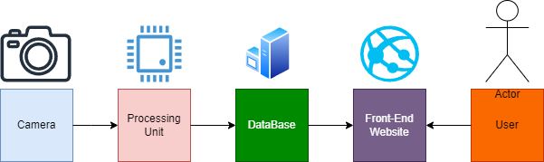
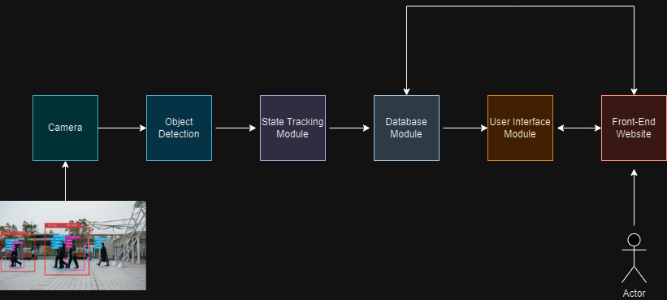
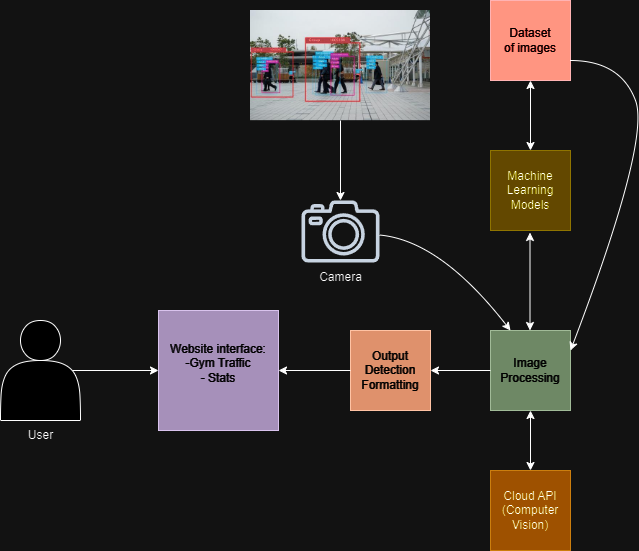

# PB-J
Senior Design Project

# Table of Contents  

1. [Team Names and Project Abstract](#team-names-and-project-abstract)  
2. [Project Description](#description)  
3. [User Stories and Design Diagrams](#user-stories-and-design-diagrams)  
   - [User Stories](#user-stories)  
   - [Design Diagrams](#design-diagrams)  
     - [Level 0 Diagram](#level-0-diagram)  
     - [Level 1 Diagram](#level-1-diagram)  
     - [Level 2 Diagram](#level-2-diagram)  
4. [Project Tasks and Timeline](#project-timeline-and-milestones-and-effort-matrix)  
   - [Task List](#tasklist)  
   - [Timeline](#timeline)  
   - [Effort Matrix](#effort-matrix)  
5. [ABET Concerns Essay](#project-constraints-summary)  
6. [PPT Slideshow](#project-slides)  
7. [Self-Assessment Essays](#self-assessment-essays)  
8. [Professional Biographies](#professional-biographies)  
9. [Budget](#budget)  
10. [Appendix](#appendix) 

# Team Names and Project Abstract 

### Team Name: PB-J  

### Members:  
- Parker Manson - Computer Science - mansonpb@mail.uc.edu
- Josh Miles - Computer Science - milesjo@mail.uc.edu  

### Advisor:  
- N/A  

## Project Abstract:  
The project aims to create a product that addresses a problem faced by the UC Rec Center. The proposed solution may incorporate artificial intelligence and motion sensor technology to provide an innovative and effective resolution. Details of the implementation are yet to be finalized as the team continues to explore and refine potential approaches.

# Description  

The Gym Equipment Usage Monitoring System is designed to enhance the user experience in gyms by utilizing video feeds to monitor equipment availability. The system identifies whether individuals are standing or sitting near specific gym equipment and tracks their usage in real-time.  

When a person is detected using a machine, the system updates a database to mark that equipment as in use, allowing gym-goers to see which machines are occupied without having to walk over. Conversely, when no one is detected in the vicinity, the system updates the status to indicate that the equipment is free.  

This information is made accessible through a user-friendly front-end website, enabling gym members to check equipment availability from anywhere in the gym. By integrating video analysis and a responsive database, this system aims to improve gym efficiency and user satisfaction.  

# User Stories and Design Diagrams  

### User Stories  

- **As the proud owner of the gym**, I want to have data of traffic in my gym, including what's being used and the frequency of use. This will help me make more informed business decisions.  

- **As a patron/customer of the gym**, I want to know what machines/areas are occupied and which ones are vacant. This will help me save time in my workout and prevent me from losing time waiting in lines for equipment.  

- **As a developer of the product**, I want to be able to smoothly capture gym traffic and extrapolate the data into information for my customers, and my customer's customers. This will help sell the product.  

## Design Diagrams  

### Level 0 Diagram  
  
### Description
This diagram provides a basic overview of the system, identifying the main input, processing, and output components.

#### Diagram Components
- **Boxes/Figures:**
  - **Camera**: Represents the video feed input.
  - **Processing Unit**: Indicates where video data is analyzed.
  - **Database**: Stores the equipment usage status.
  - **Front-End Website**: Displays the equipment availability to users. 

### Level 1 Diagram  
  
### Description
This diagram elaborates on the key modules identified in D0, detailing the functionality of each subsystem.

### Key Points
- **Camera Module**: Captures video feed and streams it to the Object Detection Module.
- **Object Detection Module**: Analyzes video frames for the presence and position of individuals.
- **State Tracking Module**: Determines if gym equipment is in use based on detection results, updating the Database Module.
- **Database Module**: Stores equipment status (in use/free) and timestamps. It also communicates with the User Interface Module.
- **User Interface Module**: Requests and displays the current status of gym equipment to the Front-End Website, allowing users to check equipment availability.
  

### Level 2 Diagram  
  
### Description
This diagram provides the most detailed view, including specific functions and interactions within the modules identified in D1.

### Diagram Components
- **Boxes/Figures:**
  - **Camera Module**
    - *Function*: Stream video.
  - **Image Processing**
    - *Function*: Analyze frames for the presence and position of individuals.
  - **Machine Learning**
    - *Function*: Determine if the equipment is used based on detected presence.
  - **Output Detection Format**
    - *Function*: Store equipment status (in use/free) and timestamps.
  - **Website Interface Module**
    - *Function*: Fetch and display current equipment status.
  - **Website Interface Module**
    - *Function*: Fetch and display current equipment status.
  - **Dataset**
    - *Function*: Contain reference Images of Humans for training.
  - **Cloud API**
    - *Function*: Identifies the main object in an image.  

# Project Timeline and Milestones and Effort Matrix

### Tasklist

1. **Research machine learning models** for detecting human presence on gym equipment using image data. *(Assigned: Parker & Josh)*

2. **Specify the list of gym equipment** to be monitored and outline how they will be visually distinguished. *(Assigned: Josh)*

3. **Design the system architecture** that integrates camera feeds, the machine learning model, and the web interface. *(Assigned: Josh)*

4. **Investigate optimal camera placement** to ensure each piece of gym equipment is fully visible for accurate detection. *(Assigned: Parker)*

5. **Develop a Python script** to capture images from the camera feed in real-time. *(Assigned: Parker)*

6. **Train a machine learning model** to classify gym equipment as either in-use or idle based on camera footage. *(Assigned: Josh)*

7. **Obtain sample images** of gym equipment in different states (in-use vs. idle) to train the model. *(Assigned: Parker & Josh)*

8. **Create a database schema** to store equipment usage data and user interactions. *(Assigned: Josh)*

9. **Design the front-end of the website** where users can see real-time updates on gym equipment usage. *(Assigned: Parker)*

10. **Develop a Flask backend** to handle the communication between the machine learning model, the database, and the web interface. *(Assigned: Parker)*

11. **Test the accuracy** of the machine learning model using validation datasets for different lighting conditions and camera angles. *(Assigned: Josh)*

12. **Validate camera connectivity** to ensure stable live feeds into the system at all times. *(Assigned: Josh)*

13. **Refine the machine learning model** based on testing results, improving detection rates for edge cases. *(Assigned: Parker)*

14. **Implement a real-time update system** on the website to show current gym equipment usage dynamically. *(Assigned: Parker)*

15. **Create user login functionality** to allow gym members to check equipment availability on the website. *(Assigned: Parker)*

16. **Test the full system** by simulating gym conditions with multiple users on various equipment. *(Assigned: Josh)*

17. **Document the final machine learning model** setup and the data preprocessing steps. *(Assigned: Josh)*

18. **Develop a notification system** to alert users when certain gym equipment becomes available. *(Assigned: Josh)*

19. **Design an admin panel** for gym staff to monitor equipment status and camera feeds. *(Assigned: Parker)*

20. **Refine the website UI** based on user feedback, optimizing for mobile and desktop users. *(Assigned: Parker)*

21. **Validate the system under peak usage times** when the gym is crowded, ensuring real-time updates remain fast and accurate. *(Assigned: Josh)*

22. **Prepare final project documentation** outlining system architecture, development steps, and deployment instructions. *(Assigned: Parker & Josh)*

### Milestones List
1. **Research & Planning Phase**  
   - Research machine learning models for detecting human presence on gym equipment.
   - Specify gym equipment to be monitored and distinguish visually between them.
   - Design system architecture for camera feeds, the ML model, and the web interface.
   - Investigate optimal camera placements for visibility and accuracy.
   
2. **Data Collection & Model Training**  
   - Develop a Python script to capture real-time images from the camera feed.
   - Collect sample images of gym equipment in various states (in-use, idle).
   - Train the machine learning model for equipment classification based on collected data.
   
3. **System Development**  
   - Design a database schema to store usage data and interactions.
   - Build the front-end website to display real-time gym equipment usage.
   - Develop a Flask backend to handle data communication.
   
4. **Testing & Refinement**  
   - Test the machine learning model for accuracy in various lighting conditions.
   - Validate stable camera connectivity for live feeds.
   - Refine the model and enhance detection rates for edge cases.
   
5. **Feature Implementation**  
   - Implement real-time updates on the website for equipment status.
   - Add user login functionality to view equipment availability.
   - Create a notification system for equipment availability updates.
   
6. **System Validation & Finalization**  
   - Test the system under gym conditions, simulating multiple users on equipment.
   - Validate performance under peak usage, ensuring accuracy and speed.
   - Finalize project documentation and prepare for deployment.

---

### Timeline

| Task                                         | Start Date  | End Date     | Milestone                    |
|----------------------------------------------|-------------|--------------|------------------------------|
| Research ML models                           | 10/09/2024  | 10/23/2024   | Research & Planning Phase    |
| Specify gym equipment                        | 10/09/2024  | 10/13/2024   | Research & Planning Phase    |
| Design system architecture                   | 10/13/2024  | 10/27/2024   | Research & Planning Phase    |
| Investigate camera placement                 | 10/13/2024  | 10/23/2024   | Research & Planning Phase    |
| Develop Python script                        | 10/24/2024  | 11/07/2024   | Data Collection & Model Training |
| Obtain sample images                         | 10/24/2024  | 11/14/2024   | Data Collection & Model Training |
| Train ML model                               | 11/15/2024  | 12/05/2024   | Data Collection & Model Training |
| Create database schema                       | 11/15/2024  | 11/30/2024   | System Development           |
| Design front-end website                     | 12/01/2024  | 12/20/2024   | System Development           |
| Develop Flask backend                        | 12/15/2024  | 01/05/2025   | System Development           |
| Test ML model accuracy                       | 01/06/2025  | 01/20/2025   | Testing & Refinement         |
| Validate camera connectivity                 | 01/06/2025  | 01/15/2025   | Testing & Refinement         |
| Refine ML model for edge cases               | 01/21/2025  | 02/05/2025   | Testing & Refinement         |
| Implement real-time updates                  | 02/06/2025  | 02/12/2025   | Feature Implementation       |
| Create user login functionality              | 02/06/2025  | 02/15/2025   | Feature Implementation       |
| Develop notification system                  | 02/16/2025  | 02/25/2025   | Feature Implementation       |
| Test full system under gym conditions        | 02/26/2025  | 03/05/2025   | System Validation & Finalization |
| Design admin panel                           | 03/06/2025  | 03/15/2025   | System Validation & Finalization |
| Validate system under peak usage             | 03/06/2025  | 03/20/2025   | System Validation & Finalization |
| Final project documentation                  | 03/21/2025  | 03/28/2025   | System Validation & Finalization |

---

### Effort Matrix

| Task                                   | Parker | Josh  |
|----------------------------------------|--------|-------|
| Research ML models                     | 50%    | 50%   |
| Specify gym equipment                  | 0%     | 100%  |
| Design system architecture             | 0%     | 100%  |
| Investigate camera placement           | 100%   | 0%    |
| Develop Python script                  | 100%   | 0%    |
| Train ML model                         | 0%     | 100%  |
| Obtain sample images                   | 50%    | 50%   |
| Create database schema                 | 0%     | 100%  |
| Design front-end website               | 100%   | 0%    |
| Develop Flask backend                  | 100%   | 0%    |
| Test ML model accuracy                 | 0%     | 100%  |
| Validate camera connectivity           | 0%     | 100%  |
| Refine ML model for edge cases         | 100%   | 0%    |
| Implement real-time updates            | 100%   | 0%    |
| Create user login functionality        | 100%   | 0%    |
| Develop notification system            | 0%     | 100%  |
| Test full system under gym conditions  | 0%     | 100%  |
| Design admin panel                     | 100%   | 0%    |
| Validate system under peak usage       | 0%     | 100%  |
| Final project documentation            | 50%    | 50%   |

# Project Constraints Summary

Our project, which uses cameras and machine learning to track gym equipment usage, faces several constraints. **Legally**, recording in gyms requires compliance with privacy laws and user consent to avoid unauthorized surveillance. **Socially**, our project aims to benefit gym-goers by providing real-time equipment availability, enhancing their workout experience. **Security** concerns include protecting video data from breaches and implementing safeguards for any associated user information on our website. Lastly, **Economic** limitations mean we’re relying on personal funds, primarily for a camera and open-source software, so we’ll focus on creating a cost-effective prototype that meets these constraints.

# Project Slides

[Slides](https://github.com/jMilesUC/PB-J/blob/main/Homework-Assignments/senior%20design%20slide%20%231.pdf)
[Presentation Video](https://mailuc-my.sharepoint.com/personal/mansonpb_mail_uc_edu/_layouts/15/stream.aspx?id=%2Fpersonal%2Fmansonpb%5Fmail%5Fuc%5Fedu%2FDocuments%2FSenior%5FDesign%5Fassignment%5F8%2Emp4&nav=eyJyZWZlcnJhbEluZm8iOnsicmVmZXJyYWxBcHAiOiJTdHJlYW1XZWJBcHAiLCJyZWZlcnJhbFZpZXciOiJTaGFyZURpYWxvZy1MaW5rIiwicmVmZXJyYWxBcHBQbGF0Zm9ybSI6IldlYiIsInJlZmVycmFsTW9kZSI6InZpZXcifX0%3D&referrer=StreamWebApp%2EWeb&referrerScenario=AddressBarCopied%2Eview%2Ef91b39f0%2D81a4%2D4440%2Db4f4%2D4ed3ed438336)

# Self-Assessment Essays

## Parker's Self-Assessments
### Fall
[Self-Assessment](https://github.com/jMilesUC/PB-J/blob/main/Homework-Assignments/Individual%20Capstone%20Assessment%20Parker.docx)

### Spring

## Josh's Self-Assessments
### Fall
[Self-Assessment](https://github.com/jMilesUC/PB-J/blob/main/Homework-Assignments/individualCapstoneAssessment.docx)

### Spring

# Professional Biographies

## Josh's Professional Biography
[Professional Biography](https://github.com/jMilesUC/PB-J/blob/main/Homework-Assignments/Professional_Biography_Josh.md)

## Parker's Professional Biography
[Professional Biography](https://github.com/jMilesUC/PB-J/blob/main/Homework-Assignments/Professional_Biography_Parker.md)

# Budget  

The software used to develop the Gym Equipment Usage Monitoring System is open-source, meaning all the development tools, libraries, and resources utilized for the project have been free of charge. This includes open-source machine learning models, video analysis software, and web development frameworks.  

Furthermore, the gym membership we are using to collect photos for the project is included as part of our tuition, so there have been no direct costs associated with gathering the necessary data for training the system.  

At this point, the project has been completed with minimal financial investment, and we will explore options for future funding or resources only if needed.

# Appendix

## Sources Cited
* Grainger Editorial Staff. “The Pros and Cons of Security Cameras in the Workplace.” Grainger KnowHow, 7 Jan. 2020, www.grainger.com/know-how/safety-health/management/kh-security-camera-pros-cons.

* Prasanth Aby Thomas, Consultant Editor. “‘body Recognition’ to Enhance Facial Recognition Technology.” Facial Recognition Technology Enhanced with “Body Recognition,” asmag.com, 2 Dec. 2020, www.asmag.com/showpost/32054.aspx.

* V7 Labs. “YOLO Object Detection: A Comprehensive Guide.” V7 Labs Blog, 26 Oct. 2023, https://www.v7labs.com/blog/yolo-object-detection.

* Redmon, Joseph. “YOLO: Real-Time Object Detection.” Darknet, 2016, https://pjreddie.com/darknet/yolo/.

* Tzutalin. “labelImg: Graphical Image Annotation Tool.” PyPI, Python Software Foundation, https://pypi.org/project/labelImg/.

* “LabelImg for Image Annotation.” Viso.ai, 23 Mar. 2022, https://viso.ai/computer-vision/labelimg-for-image-annotation/.

* Barange, Praveen. “Simplifying Data Annotation with labelImg: A Comprehensive Guide.” Medium, 12 Mar. 2021, https://medium.com/@praveenbarange55/simplifying-data-annotation-with-labelimg-a-comprehensive-guide-236ecf549284.

